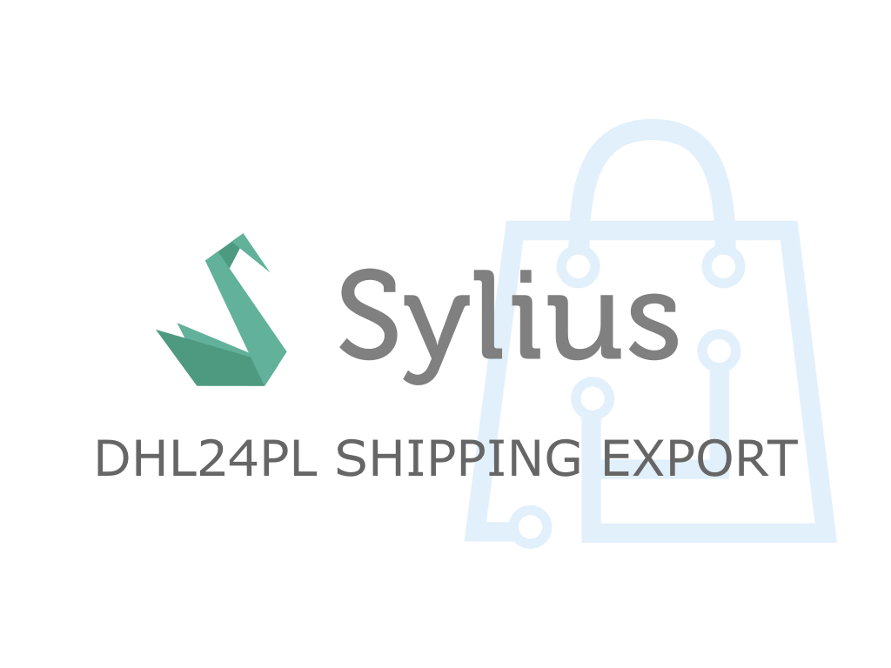

<h1 align="center">
    <a href="http://bitbag.shop" target="_blank">
        
    </a>
    <br />
    <a href="https://packagist.org/packages/bitbag/dhl24-pl-shipping-export-plugin" title="License" target="_blank">
        
    </a>
    <a href="https://packagist.org/packages/bitbag/dhl24-pl-shipping-export-plugin" title="Version" target="_blank">
        
    </a>
    <a href="http://travis-ci.org/BitBagCommerce/SyliusDHL24PlShippingExportPlugin" title="Build status" target="_blank">
            
        </a>
    <a href="https://scrutinizer-ci.com/g/BitBagCommerce/SyliusDHL24PlShippingExportPlugin/" title="Scrutinizer" target="_blank">
        
    </a>
    <a href="https://packagist.org/packages/bitbag/dhl24-pl-shipping-export-plugin" title="Total Downloads" target="_blank">
        
    </a>
    <p>
        
    </p>
</h1>

## Overview

This plugin was made on top of our ShippingExport abstraction layer. It's goal is to allow exporting DHL24PL shipments to external 
web API in Sylius platform based apps. Each time new shipment for a configured 
DHL gateway is placed you will see a new shipment in the shipping export tab.

## Support

We work on amazing eCommerce projects on top of Sylius and other great Symfony based solutions, like eZ Platform, Akeneo or Pimcore.
Need some help or additional resources for a project? Write us an email on mikolaj.krol@bitbag.pl or visit
[our website](https://bitbag.shop/)! :rocket:

## Demo

We created a demo app with some useful use-cases of the plugin! Visit [demo.bitbag.shop](https://demo.bitbag.shop) to take a look at it. 

```bash
$ composer require bitbag/dhl24-pl-shipping-export-plugin
```

Add plugin dependencies to your `config/bundles.php` file:
```php
return [
    ...

    BitBag\SyliusDhl24PlPlugin\BitBagSyliusDhl24PlPlugin::class => ['all' => true],
];
```

## Customization

### Available services you can [decorate](https://symfony.com/doc/current/service_container/service_decoration.html) and forms you can [extend](http://symfony.com/doc/current/form/create_form_type_extension.html)

Run the below command to see what Symfony services are shared with this plugin:
```bash
$ bin/console debug:container bitbag_sylius_dhl24pl_plugin
```

## Testing
```bash
$ composer install
$ cd tests/Application
$ yarn install
$ yarn run gulp
$ bin/console assets:install -e test
$ bin/console doctrine:database:create -e test
$ bin/console doctrine:schema:create -e test
$ bin/console server:run 127.0.0.1:8080 -e test
$ open http://localhost:8080
$ bin/behat
$ bin/phpspec run
```

## Contribution

Learn more about our contribution workflow on http://docs.sylius.org/en/latest/contributing/.
