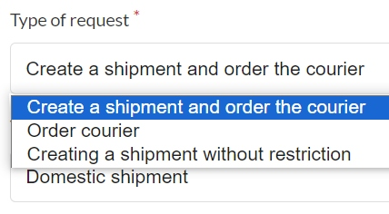
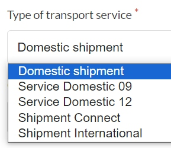
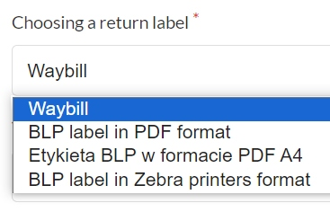
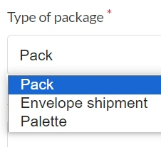

# Functionalities

---
### Introduction
DHL International GmbH - a German parcel and logistics company operating in the international courier segment.
It has a worldwide reach.

The plugin allows you to make a DHL24 (PL) courier order with one click of the mouse, without having to fill in the data each time.

This plugin supports communication with the DHL API, including exporting shipping data
and creating ready-made labels to print directly from the order.

### Usage
After installation, the user can add a shipping method corresponding to the service provider he wants to ship to.

    

Then he create a new "shipping gateway" for the added shipping method.

    

    <b>It is possible to select:</b>

    type of request

    

    type of transport service

    

    return label

    

    type of package

    

Once the shipping method and shipping gateway for the shipping provider are created,
customer can use this shipping method during a checkout. When the order is placed,
user can now go to the 'Export shipping data' section from Sylius Admin Panel and export chosen shipments.

After exporting the shipment, it is possible to download the label for printing.

    

