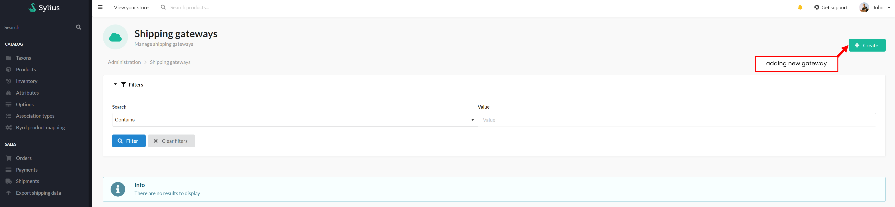

# Functionalities

---
### Introduction

---
DHL International GmbH - a German parcel and logistics company operating in the international courier segment.
It has a worldwide reach.

The plugin allows you to make a DHL24 (PL) courier order with one click of the mouse, without having to fill in the data each time.

This plugin supports communication with the DHL API, including exporting shipping data
and creating ready-made labels to print directly from the order.

### Usage

---
#### Adding Shipping Gate

After installation, users can add the shipping method corresponding to the service provider
to which they want to export shipments.

    

 

It then creates a new "shipping gateway" for the added shipping method.
When a customer selects this shipping method when ordering products, the order will be captured by the gateway.

    

 

Selects the shipping method and completes the form fields accordingly.

    

 

#### API options

It is possible to select:

    

 

Determine the payment page:
- Sender
- Recipient
- Third party

Payment method:
- Bank transfer
- Cash payment

Type of request:
- Create the shipment and order the courier
- Order courier
- Creating a shipment without restriction

Type of transport service:
- Domestic shipment
- Service Domestic 09
- Service Domestic 12
- Shipment Connect
- Shipment International

Choosing a return label:
- Waybill
- BLP label in PDF format
- BLP label in A4 PDF format
- BLP label in Zebra printers format

Form of download return in COD service:
- Cash payment
- Bank transfer

**_Shipment start hour_**:
Specifies the time from which the shipment is ready for collection by the courier

**_Shipment end hour_**:
Specifies the end time by which the courier can arrive to pick up the shipment.
After this hour, the shipment may no longer be available for pickup.

**_Pickup breaking hour_**:
Specifies the cut-off time by which the courier can come to pick up the shipment.
This is the hour after which the collection of the shipment will be postponed to the next business day.

 

#### Shipping Exports
Once the shipping method and shipping gateway for the shipping provider are created,
customer can use this shipping method during a checkout. When the order is placed,
user can now go to the 'Export shipping data' section from Sylius Admin Panel and export chosen shipments.

After exporting the shipment, it is possible to download the label for printing.

    

